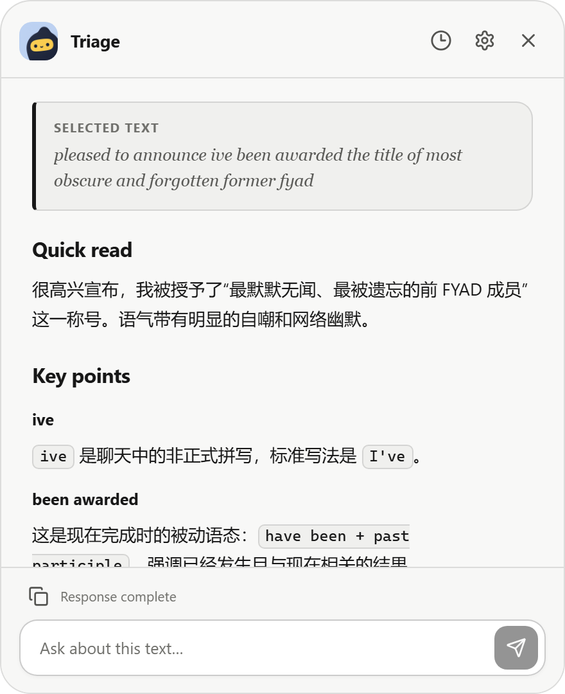
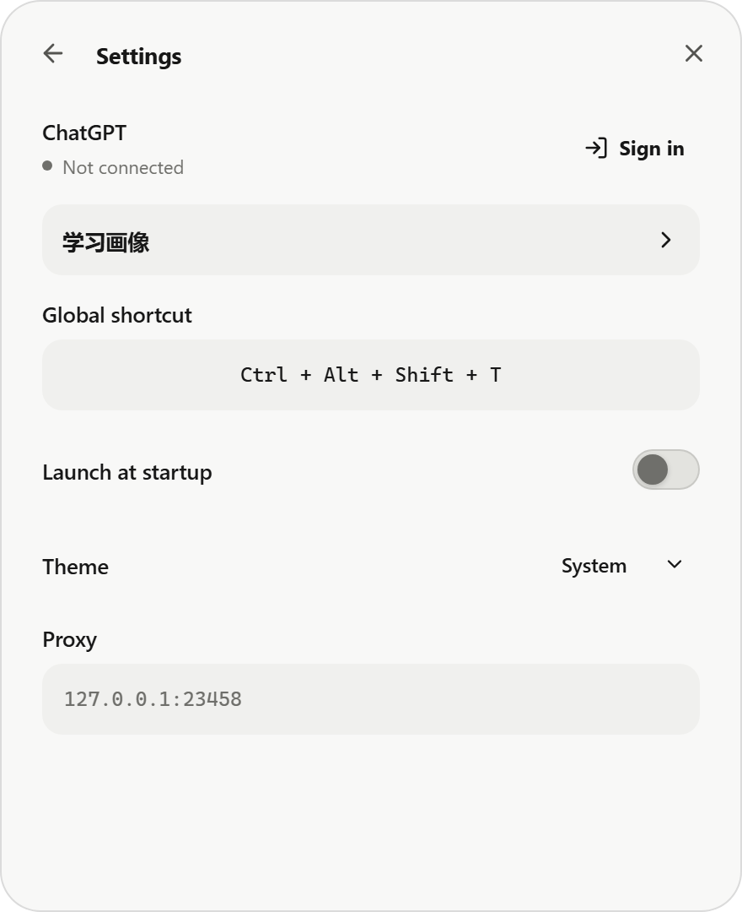

# Gloss

Gloss 是英文阅读与写作助手，也支持自适应中英文双向翻译。目前提供 Windows 安装包，macOS 可从源码构建使用。选中文本，按下快捷键，即可理解、翻译或修正表达。

  

## 阅读，不打断当前页面

- **Triage**：理解原文，梳理值得关注的表达、句式与背景。
- **Translate**：自动识别中文或英文，并翻译成另一种语言。
- **Correct**：修正英文语法和不自然的表达，同时保留原意与语气。
- **继续追问**：直接提问，或选中回答中的片段快速解释。

<table>
  <tr>
    <td width="50%"></td>
    <td width="50%"></td>
  </tr>
  <tr>
    <td align="center">Triage</td>
    <td align="center">Settings</td>
  </tr>
</table>

## 安装

支持 Windows 10/11。前往 [Releases](../../releases) 下载 Windows x64 安装程序，并使用可访问 Codex 的 ChatGPT 账号登录。

macOS 暂需按照[开发文档](docs/development.md#构建发布版本)在 Mac 上自行构建，将 `Gloss.app` 放在固定位置后启动。在系统设置的“隐私与安全性 → 辅助功能”中允许 Gloss 读取选中文字；重新构建后如果取词提示无权限，请重新检查该授权。已在 Apple Silicon / macOS 26.4 上完成 Chrome 和 Zotero 核心流程的手工验证，具体范围见[验证记录](docs/development.md#macos-验证记录)。

## 使用

1. 选中中文或英文文本。
2. 按 `Ctrl + Alt + Shift + T` 唤出 Gloss；macOS 对应 `Control + Option + Shift + T`。
3. 使用主按钮执行当前模式，或通过箭头选择 **Triage**、**Translate** 或 **Correct**。

快捷键、主题、代理和开机启动均可在 Settings 中调整。

## 开发

[开发文档](docs/development.md) · [第三方组件](THIRD_PARTY_NOTICES.md)
